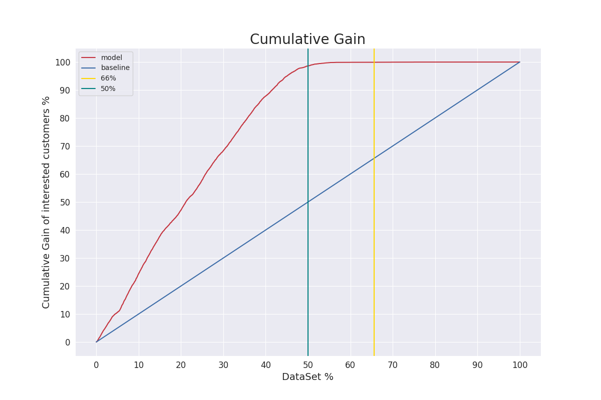

# Problema de negócio

## A Empresa Insurance All

O Contexto a seguir, é completamente fictício. E o problema foi retirado do blog: https://sejaumdatascientist.com/como-usar-data-science-para-fazer-a-empresa-vender-mais/

A Insurance All é uma empresa que fornece seguro de saúde para seus clientes e o time de produtos está analisando a possibilidade de oferecer aos assegurados, um novo produto: Um seguro de automóveis.

Assim como o seguro de saúde, os clientes desse novo plano de seguro de automóveis precisam pagar um valor anualmente à Insurance All para obter um valor assegurado pela empresa, destinado aos custos de um eventual acidente ou dano ao veículo.

A Insurance All fez uma pesquisa com cerca de 380 mil clientes sobre o interesse em aderir a um novo produto de seguro de automóveis, no ano passado. Todos os clientes demonstraram interesse ou não em adquirir o seguro de automóvel e essas respostas ficaram salvas em um banco de dados junto com outros atributos dos clientes.

O time de produtos selecionou 127 mil novos clientes que não responderam a pesquisa para participar de uma campanha, no qual receberão a oferta do novo produto de seguro de automóveis. A oferta será feita pelo time de vendas através de ligações telefônicas.

Contudo, o time de vendas tem uma capacidade de realizar 20 mil ligações dentro do período da campanha.

## O Desafio

construir um modelo que prediz a probabilidade de um cliente ser classificado como uma pessoa que irá querer adquirir o novo seguro.

Com a sua solução, o time de vendas espera conseguir priorizar as pessoas com maior interesse no novo produto e assim, otimizar a campanha realizando apenas contatos aos clientes mais propensos a realizar a compra.

- Entregar um relatório contendo algumas análises e respostas às seguintes perguntas:

    1. Principais Insights sobre os atributos mais relevantes de clientes interessados em adquirir um seguro de automóvel.

    2. Qual a porcentagem de clientes interessados em adquirir um seguro de automóvel, o time de vendas conseguirá contatar fazendo 20.000 ligações?

    3. E se a capacidade do time de vendas aumentar para 40.000 ligações, qual a porcentagem de clientes interessados em adquirir um seguro de automóvel o time de vendas conseguirá contatar?

    4. Quantas ligações o time de vendas precisa fazer para contatar 80% dos clientes interessados em adquirir um seguro de automóvel?

## Proposta de solução

- Estudar os dados, encontrar insights importantes tanto para empresa.
- Treinar um algoritmo de machine learning para fazer o rankeamento baseado na base de treino
- Baseado no algoritmo escolhido, irei ordenar a base de teste de forma que os clientes com mais propensão de adquirir o novo seguro sejam captados de uma maneira mais acertiva.
 - Criar uma API para utilização desse modelo seguido do deploy.

## Os Dados

O conjunto de dados está disponível na plataforma do Kaggle, através desse link: https://www.kaggle.com/anmolkumar/health-insurance-cross-sell-prediction

Cada linha representa um cliente e cada coluna contém alguns atributos que descrevem esse cliente, além da sua resposta à pesquisa, na qual ela mencionou interesse ou não ao novo produto de seguros.

O conjunto de dados inclui as seguintes informações:

- Id: identificador único do cliente.
- Gender: gênero do cliente.
- Age: idade do cliente.
- Driving License: 0, o cliente não tem permissão para dirigir e 1, o cliente tem para dirigir ( CNH – Carteira Nacional de Habilitação )
- Region Code: código da região do cliente.
- Previously Insured: 0, o cliente não tem seguro de automóvel e 1, o cliente já tem seguro de automóvel.
- Vehicle Age: idade do veículo.
- Vehicle Damage: 0, cliente nunca teve seu veículo danificado no passado e 1, cliente já teve seu veículo danificado no passado.
- Anual Premium: quantidade que o cliente pagou à empresa pelo seguro de saúde anual.
- Policy sales channel: código anônimo para o canal de contato com o cliente.
- Vintage: número de dias que o cliente se associou à empresa através da compra do seguro de saúde.
- Response: 0, o cliente não tem interesse e 1, o cliente tem interesse.

# Solução
O objetivo foi aplicar o modelo para conseguir rankear os novos clientes com maior propensão de compra (de adquirir) do novo seguro.

Uma lista ordenada de clientes com maior propensão de compra sintetiza os clientes que de fato podem querer adquirir o novo produto
serviço. Gerando assim uma redução de custo de aquisição desses clientes e percorrendo uma porcentagem menor da base dados para atingir a quantidade de clientes interessados.

Para 40.000 ligações, qual a porcentagem de clientes interessados em adquirir um seguro de automóvel o time de vendas conseguirá contatar?

Para 40.000 ligações (40.000 representa em torno de 66% da base de dados) consigo alcançar 100% das pessoas interessadas. Mas o que é interessante é que consigo chegar nessa mesma porcentagem de pessoas interessadas com um pouco mais de 50% da base de dados. Percorrer uma menor porcentagem da base de dados significa utilizar menos recursos para alcançar a mesma quantidade de pessoas.

Ou seja, como resultados teríamos:

- Uma redução de aproxidamente 16% do número de ligações necessárias para encontrar todas as pessoas interessadas no novo seguro.
- Aumento da receita ao utilizar o modelo que comparado com o baseline nos dá o dobro de pessoas interessadas em adquirir o novo seguro.



Mais informações: https://www.linkedin.com/feed/update/urn:li:activity:6894438204783558656/

# Docker
Na raiz do projeto.
```sh
# create image
docker build -t docker_fastapi:v1 -f ./docker/Dockerfile .

# run
docker run --name container_fastapi_v1 -p 8080:80  docker_fastapi:v1
```
Para acessar o Swagger da API http://0.0.0.0:8080/docs

# Compute test coverage
```sh
python3 -m pytest --cov=tests --cov-report html:cov_html
```
